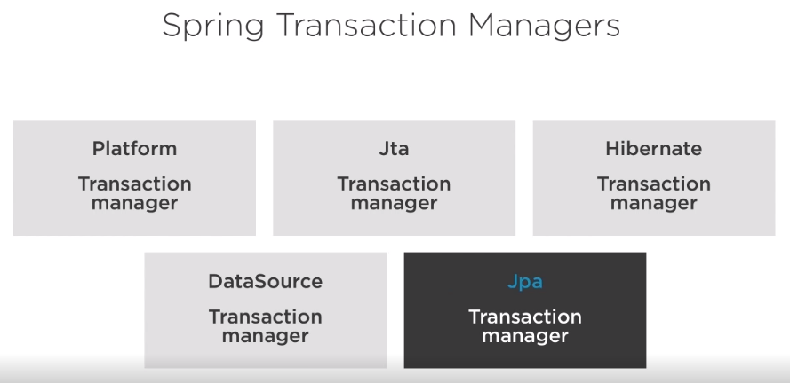
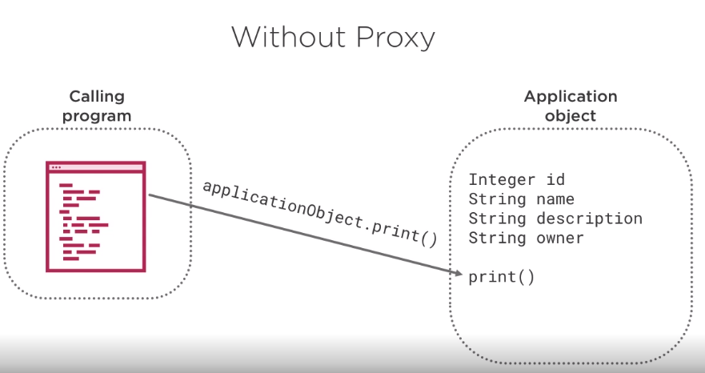
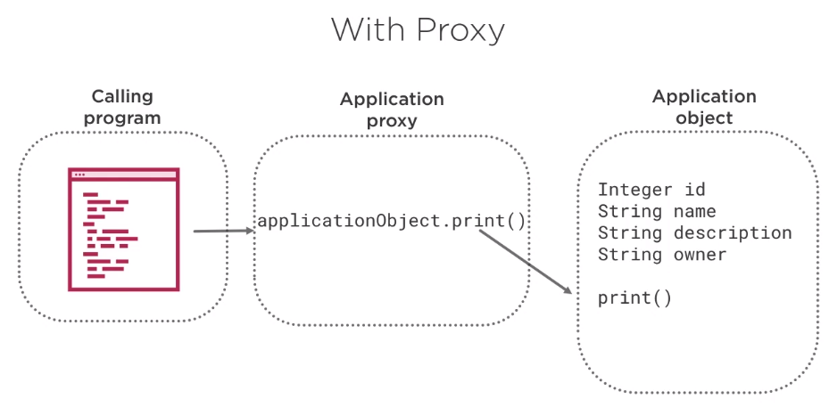
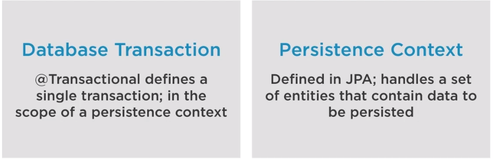
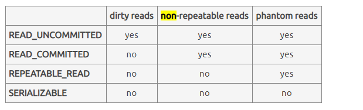

# Spring and Transaction Management

## Summary
* Transactions
* Four Key Properties of Transactions
* Transaction Boundaries
* Concurrent Transactions

TrackZilla - Bug Tracking Tool

## Transaction
A series of actions that are treated as a single unit of work. Although there are many actions in a single transaction, all should either fail as a group or complete entirely as a group.

**Transaction Management:** Transaction Management ensures data consistency and integrity.

### Four Key Properties - ACID
* Atomicity - A transaction must either fully happen or not happen at all.
* Consistency - A transaction is committed once all of its actions have completed. It keep data in a consisted state
* Isolation - Each transaction must be isolated from others transactions to ensure that data is not corrupted. Isolation ensures that one transaction cannot read data from another transaction
* Durability - Durability means that a transaction must not be undone by a system failure tipically because it is written to persistent storage

### Transactions Type - Global Transactions & Local Transaction
**Global Transactions:** Multiple resources manage the transactions (resources as queues and databases can be involved in the transaction context) 

**Local Transactions:** One resource manages the transaction

A global transaction is a mechanism that allows a set of programming tasks, potentially using more than one resource manager and potentially executing on multiple servers, to be treated as one logical unit. Also, a global transaction may be composed of several local transactions, each accessing the same resource manager. The resource manager is responsible for performing concurrency control and atomicity of updates. A given local transaction may be either successful or unsuccessful in completing its access; it cannot be partially successful.

## Spring Framework’s declarative transaction
**What is declarative transactions?** This means you separate transaction management from the business code. You only use annotations

By using Spring Boot project with **spring-data** or spring-tx dependencies, then transaction management will be enabled by default. 

**A transaction has the ACID concept:**

**Atomicity** – A transaction should be treated as a single unit of operation, which means either the entire sequence of operations is successful or unsuccessful.

**Consistency** - Ensures that a transaction can only bring the database from one valid state to another

**Isolation** – There may be several transactions processing with the same data set. Each transaction should be isolated from others to prevent data corruption

**Durability** – Once a transaction has completed, its result must be made permanent and cannot be removed from the db due failure;

### Manager Of Transactions
There are several different APIs that help developers to manage transactions, some of them are listed below:
* Java Transaction API
* Java Persistence API
* Java Database Connectivity
* Hibernate
* ...

The advantages of using Spring to manage transactions is that it provides a **consistent programming model** across all of those APIs

### Spring Transactions Managers

#### Hibernate TransactionManager
A uniform API that uses the feature of Hibernate's transactions, while maintaining the advantage of Spring's unified transaction abstractions

### Database Transaction vs Persistence Context
A database transaction happens inside the scope of a persistence context, it and EntityManager are concepts defined in the JPA and are implemented internally by Hibernated Session

### !Transactions and Proxies!
For every class annotated with @Transactional Spring creates a proxy to hold transaction management code. Even if the annotation is on methods or on class level. So that only external method calls that come in through the proxy will be intercepted. Any self-invocation call will not start any transaction, even if the method has the @Transactional annotation.

**Without Proxy**

How does program calling work without proxy? Firstly, when there are the invocation of a method on an **object reference**, this method is invoked directly on the **object**

**With Proxy**
By using a proxy, the method invocation is no longer invoked directly on the object, but instead on a reference to the proxy. And, as such, the proxy delegates to all of the interceptors relevante to that particular method call.

How it works? Proxy use transaction interceptorm, which intercepts method call on the associated target class. This occurs in conjunction with an appropriate **platform transaction manager** to handle transaction.

### Componentes that Make Declarative transactions Work
1. **EntityManager** Proxy
	- Entities are objects that "live" in a database and are managed by the **EntityManager**
	- EntityManager defines the methods that are used to interact with the **Persistence Context**
2. **Persistence Context** Proxy
	-  Database transactions happen inside the scope of a **Persistence Context**
	- Each **EntityManager** instance is associated with a Persistence Context
	- Defines the scope under which particular entity instances are created, persited and removed
3. **Transaction Aspec** 
	- It manages transactions for any method with the **@Transactional**
	- It also uses a **Transaction Interceptor**. And, as such, the **Transaction Interceptor** intercepts method call ffor an associated target class
		- Transaction Interceptor are called before and after the invoked method of the object reference
	-  Two Main Responsibilities
		- Determines if a new transaction is needed
		- Determines to commit, rollback, or leave running 
4. **Transaction Manager**
	-  Is the Spring's platform transaction manager
	- Responsible for providing essential methods for controlling transactions operations at runtime (like: Begin commit and rollback)
	

	
### Declarative Transactions -> @Transactional
In order to enable transactional management **@Transactional** Annotation is used either at **class** or **method** level

The annotation supports further configuration as well:

-  **Propagation Type** of the transaction - [spring-propagation-example](https://stackoverflow.com/questions/25076718/spring-propagation-examples-in-laymans-terms/25083505#25083505) (rephrase the explanation)
-  **Isolation Level** of the transaction
-  **Timeout** for the operation wrapped by the transaction
-  **readOnly** flag – a hint for the persistence provider that the transaction should be read only
-  **Rollback** rules for the transaction

#### Propagation Parameter
It defines how transactions relate to each other.

**Options of Propagation**
- REQUIRED (Default): Code will always run in a transaction, or it created a new transaction or reused an existing one.
- REQUIRED_NEW: Code will **always run in a new transaction** suspending the current if one exists.
- NEVER: Method shouldn't be run within a transaction.
- NESTED: If a transaction exists, then if yes, it marks a savepoint. This means if our business logic execution throws an exception, then transaction rollbacks to this savepoint. If there's no active transaction, it works like REQUIRED.

#### Rollback Information
 By default, rollback just happens for runtime, unchecked exceptions. In other words, the **checked exceptions does not trigger rollbacks** of transactions.

Regarding the rollback, is possible to enable rollbacks for checked exceptions using the following annotation’s parameters:
- **rollbackFor(*Optional array of exception classes that must cause rollback.*)** 
- **noRollbackFor(*Optional array of exception classes that must not cause rollback.*)**.

 `@Transactional(rollbackFor = Exception.class)`

#### Isolation information
Define how data within transactions are available to other process, users, and systems. There is three types of isolation as you can see below:

* READ_UNCOMMITTED: Allows Dirty reads. A transaction can read data written but not committed by **other transaction**.
* READ_COMMITTED: Dirty reads are not allowed.
* REPEATABLE_READ: If a row is read twice in the same transaction, the result will always be the same
* SERIALIZABLE: Performs all transactions in a sequence

**Dirty Reads**: read UNCOMMITED data from another transaction | read the uncommitted change of a concurrent transaction
**Non-Repeatable** reads: read COMMITTED data from an UPDATE query from another transaction | get different value on re-read of a row if a concurrent transaction updates the same row and commits
**Phantom** reads: read COMMITTED data from an INSERT or DELETE query from another transaction  | get different rows after re-execution of a range query if another transaction adds or removes some rows in the range and commits

## SpringBoot Facilities

@EnableTransactionManagement - Annotation that enables Spring's annotation-driven transaction management capabilities. **When using SpringBoot **@EnableTransactionManagement  is no longer necessary to be written because it is automatically configurated by SpringBoot

### Automatic Configuration
* @Transactional works without add extra configuration
* Declarative transaction management works, although a platform transaction manager were not defined

### Using Started Spring-Data-JPA
* JPA Transaction manager is registred by Spring
* Calls to Spring Data Repositories are by default surrounded by transaction. Spring will reuse the existing transaction to perform the action, if there is no transaction it will create a new one

## Trace Transaction Behavior
Add the following property in the `applications.properties`
>logging.level.org.springframework.transaction.interceptor=TRACE
 

## References
[https://docs.spring.io/spring/docs/4.2.x/spring-framework-reference/html/transaction.html](https://docs.spring.io/spring/docs/4.2.x/spring-framework-reference/html/transaction.html)

[https://www.tutorialspoint.com/spring/spring_transaction_management.htm](https://www.tutorialspoint.com/spring/spring_transaction_management.htm)

[https://www.baeldung.com/transaction-configuration-with-jpa-and-spring](https://www.baeldung.com/transaction-configuration-with-jpa-and-spring)

Java Dynamic Proxy -> [https://spring.io/blog/2012/05/23/transactions-caching-and-aop-understanding-proxy-usage-in-spring](https://spring.io/blog/2012/05/23/transactions-caching-and-aop-understanding-proxy-usage-in-spring)